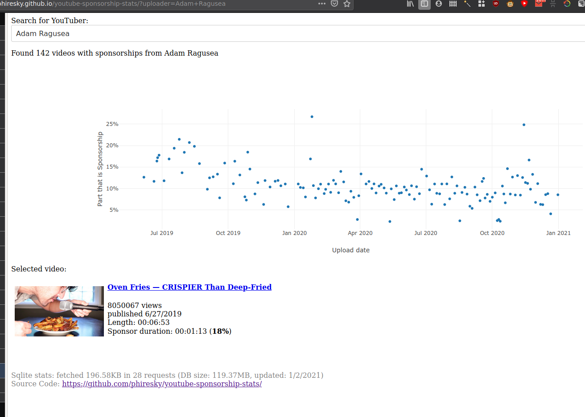

# youtube-sponsorship-stats

This tool uses the [SponsorBlock](https://sponsor.ajay.app/) database to show a chart of how much time sponsorships take up in the videos of a specific YouTuber.

The data is stored in an SQLite database (150MB) and hosted on GitHub Pages. The SQLite engine is compiled as WASM and run directly in the browser. The database pages are fetched on demand from the remote URL by using a virtual filesystem that delegates to AJAX requests. This means that to get the data of one uploader, only around 300kB of data need to be fetched, not the whole database of 150MByte.

## Wait what? You are using GitHub Pages as a database engine? Also, I thought GitHub had a file size limit of 100MB?

Yes

## Building

1. Compile sqlite wasm: `cd sql.js && yarn && yarn build -j8 EMCC=/usr/lib/emscripten/emcc`
2. Create the database: `./create_db.sh` (note that you will need the videoData table which is not present in the normal sponsorblock dumps)
3. Build the website: `yarn dev` or `yarn build`